# Enterprise Multi-Agent System Architecture

## Overview

This document presents the comprehensive enterprise architecture of the multi-agent system with LiteLLM Azure OpenAI integration and AG-UI protocol support, showing all services, their relationships, and communication patterns including frontend integration capabilities.

## Architecture Diagram

```mermaid
graph TB
    %% Frontend & User Interface
    Frontend[🖥️ Frontend Application<br/>React/Vue/Angular] --> AGUI[🔌 AG-UI Protocol<br/>WebSocket/SSE/HTTP]
    User[👤 User Request] --> Frontend
    
    %% AG-UI Protocol Layer
    AGUI --> Orchestrator[🎯 Orchestrator Agent<br/>Port 8001<br/>EnterpriseOrchestrator<br/>+ AG-UI Protocol Server]
    
    %% External Systems
    AzureOpenAI[☁️ Azure OpenAI<br/>GPT-4o Models] --> LiteLLM[🔧 LiteLLM Integration]
    
    %% Redis Integration
    Redis[(🔴 Redis<br/>Session Management<br/>Agent Registry)] --> Orchestrator
    Orchestrator --> Redis
    
    %% LiteLLM Integration Layer
    LiteLLM --> Orchestrator
    LiteLLM --> DataAgent[🔍 Data Search Agent<br/>Port 8002<br/>DataSearchAgent]
    LiteLLM --> ReportAgent[📊 Reporting Agent<br/>Port 8004<br/>ReportingAgent]
    LiteLLM --> ExampleAgent[⚙️ Example Agent<br/>Port 8005<br/>CustomAnalyticsAgent]
    
    %% Agent Communication
    Orchestrator -->|A2A Protocol| DataAgent
    Orchestrator -->|A2A Protocol| ReportAgent
    Orchestrator -->|A2A Protocol| ExampleAgent
    
    %% MCP Tool Server
    DataAgent -->|MCP Tools| MCPServer[🛠️ MCP Tool Server<br/>Port 8003<br/>EnterpriseMCPServer]
    ReportAgent -->|MCP Tools| MCPServer
    ExampleAgent -->|MCP Tools| MCPServer
    
    %% Data Layer
    MCPServer --> Database[(🗄️ Enterprise Database<br/>SQL Queries)]
    MCPServer --> Documents[(📄 Document Repository<br/>Search & Indexing)]
    MCPServer --> Analytics[(📈 Analytics Engine<br/>Business Intelligence)]
    
    %% Shared Libraries
    subgraph SharedLibraries[📚 ADK-Shared Libraries]
        AgentRegistry[🏪 Agent Registry<br/>Dynamic Discovery]
        Observability[📊 Observability<br/>Simple Logging & Tracing]
        Security[🔐 Security<br/>JWT Authentication]
        LiteLLMIntegration[🤖 LiteLLM Integration<br/>Azure OpenAI Wrapper]
        AGUIProtocol[🔌 AG-UI Protocol<br/>Session Management<br/>WebSocket Support]
    end
    
    %% Service Dependencies
    Orchestrator -.->|Uses| AgentRegistry
    Orchestrator -.->|Uses| Observability
    Orchestrator -.->|Uses| Security
    Orchestrator -.->|Uses| LiteLLMIntegration
    Orchestrator -.->|Uses| AGUIProtocol
    
    DataAgent -.->|Uses| Observability
    DataAgent -.->|Uses| Security
    DataAgent -.->|Uses| LiteLLMIntegration
    
    ReportAgent -.->|Uses| Observability
    ReportAgent -.->|Uses| Security
    ReportAgent -.->|Uses| LiteLLMIntegration
    
    ExampleAgent -.->|Uses| AgentRegistry
    ExampleAgent -.->|Uses| Observability
    ExampleAgent -.->|Uses| Security
    ExampleAgent -.->|Uses| LiteLLMIntegration
    
    MCPServer -.->|Uses| Observability
    MCPServer -.->|Uses| Security
    
    %% Monitoring & Observability
    Orchestrator --> CloudTrace[☁️ Cloud Trace<br/>Distributed Tracing]
    DataAgent --> CloudTrace
    ReportAgent --> CloudTrace
    ExampleAgent --> CloudTrace
    MCPServer --> CloudTrace
    
    %% Policy & Governance
    PolicyEngine[⚖️ Policy Engine<br/>Governance Rules] --> Orchestrator
    
    %% Configuration Management
    subgraph ConfigLayer[⚙️ Configuration Layer]
        EnvConfig[🔧 Environment Config<br/>Azure OpenAI Credentials]
        AgentConfigs[📋 Agent Configurations<br/>YAML Files]
        PolicyConfig[📜 Policy Configurations<br/>Governance Rules]
    end
    
    EnvConfig --> LiteLLMIntegration
    AgentConfigs --> Orchestrator
    AgentConfigs --> DataAgent
    AgentConfigs --> ReportAgent
    AgentConfigs --> ExampleAgent
    PolicyConfig --> Orchestrator
    
    %% Styling
    classDef orchestrator fill:#e1f5fe,stroke:#01579b,stroke-width:3px
    classDef agent fill:#f3e5f5,stroke:#4a148c,stroke-width:2px
    classDef mcp fill:#fff3e0,stroke:#e65100,stroke-width:2px
    classDef shared fill:#e8f5e8,stroke:#1b5e20,stroke-width:2px
    classDef external fill:#fce4ec,stroke:#880e4f,stroke-width:2px
    classDef data fill:#f1f8e9,stroke:#33691e,stroke-width:2px
    
    class Orchestrator orchestrator
    class DataAgent,ReportAgent,ExampleAgent agent
    class MCPServer mcp
    class SharedLibraries,AgentRegistry,Observability,Security,LiteLLMIntegration shared
    class User,AzureOpenAI,Gateway external
    class Database,Documents,Analytics data
```



## Service Architecture Details

### 🎯 Orchestrator Agent (Port 8001)
**Role**: Central coordination and request routing with AG-UI protocol support
- **Class**: `EnterpriseOrchestrator(LlmAgent)`
- **Responsibilities**:
  - Agent selection using LiteLLM-powered reasoning
  - Policy enforcement and governance
  - Request routing via A2A protocol
  - Load balancing and failover
  - AG-UI protocol server for frontend communication
  - Session management and WebSocket support
- **LiteLLM Integration**: Uses Azure OpenAI for intelligent agent selection
- **AG-UI Protocol**: WebSocket, SSE, and HTTP endpoints for frontend integration
- **Redis Integration**: Session storage and agent registry
- **Endpoints**: 
  - **Core**: `/process`, `/agents`, `/health`
  - **AG-UI**: `/agui/sessions`, `/agui/messages`, `/agui/stream`, `/agui/ws`

### 🔍 Data Search Agent (Port 8002)
**Role**: Specialized data retrieval and search operations
- **Class**: `DataSearchAgent(Agent)`
- **Responsibilities**:
  - SQL query execution
  - Document search and indexing
  - Data extraction and formatting
- **LiteLLM Integration**: Uses Azure OpenAI for query understanding
- **MCP Tools**: `query_database`, `search_documents`
- **Endpoints**: `/search`, `/health`

### 📊 Reporting Agent (Port 8004)
**Role**: Business reporting and analytics
- **Class**: `ReportingAgent(Agent)`
- **Responsibilities**:
  - Report generation
  - Analytics processing
  - Business insights
  - Data visualization
- **LiteLLM Integration**: Uses Azure OpenAI for report generation
- **MCP Tools**: `run_analytics`, `query_database`, `search_documents`
- **Endpoints**: `/report`, `/health`

### ⚙️ Example Agent (Port 8005)
**Role**: Custom analytics and trend forecasting with MCP integration
- **Class**: `MyCustomAgent(SelfRegisteringAgent, LlmAgent)`
- **MCP Integration**: Proper MCP client following ADK documentation
- **Responsibilities**:
  - Custom analytics processing
  - Trend forecasting
  - Business intelligence
  - MCP tool integration (enterprise shared tools)
- **LiteLLM Integration**: Uses Azure OpenAI for analytics insights
- **Auto-registration**: Dynamic service discovery
- **MCP Tools**: Connects to enterprise MCP server for shared tools
- **Endpoints**: `/analytics`, `/health`

### 🛠️ MCP Tool Server (Port 8003)
**Role**: Centralized tool registry and execution via MCP protocol
- **Class**: `EnterpriseMCPServer(MCPToolServer)`
- **Implementation**: Standard MCP protocol following ADK documentation
- **Responsibilities**:
  - MCP protocol compliance with ADK patterns
  - Tool registration and management via YAML configuration
  - Tool execution with authentication and observability
  - Enterprise data access with proper tracing
- **Configuration**: `config/mcp_config.yaml` for tool definitions
- **Observability**: Full OpenTelemetry integration
- **Tools Available**:
  - `DatabaseQueryTool`: SQL query execution
  - `DocumentSearchTool`: Document search and retrieval
  - `AnalyticsTool`: Business analytics and insights
- **Endpoints**: `/mcp` (MCP protocol endpoint)

## AG-UI Protocol Architecture

### 🔌 AG-UI Protocol Components

```mermaid
graph TB
    subgraph FrontendLayer[🖥️ Frontend Layer]
        WebApp[🌐 Web Application<br/>React/Vue/Angular]
        MobileApp[📱 Mobile Application<br/>React Native/Flutter]
    end
    
    subgraph AGUILayer[🔌 AG-UI Protocol Layer]
        HTTPEndpoints[🌐 HTTP Endpoints<br/>REST API]
        SSEEndpoints[📡 Server-Sent Events<br/>Real-time Streaming]
        WebSocketEndpoints[🔌 WebSocket<br/>Bidirectional Communication]
    end
    
    subgraph SessionLayer[💾 Session Management]
        RedisSessions[🔴 Redis Sessions<br/>Session Storage]
        MessageQueue[📨 Message Queue<br/>Event Processing]
    end
    
    subgraph OrchestratorLayer[🎯 Orchestrator Integration]
        AGUIServer[🔌 AGUIProtocolServer<br/>Protocol Handler]
        MessageHandler[💬 MessageHandler<br/>Request Processing]
        StreamingHandler[📡 StreamingHandler<br/>Real-time Responses]
        EventEmitter[📢 EventEmitter<br/>WebSocket Events]
    end
    
    WebApp --> HTTPEndpoints
    WebApp --> SSEEndpoints
    WebApp --> WebSocketEndpoints
    MobileApp --> HTTPEndpoints
    MobileApp --> WebSocketEndpoints
    
    HTTPEndpoints --> AGUIServer
    SSEEndpoints --> AGUIServer
    WebSocketEndpoints --> AGUIServer
    
    AGUIServer --> MessageHandler
    AGUIServer --> StreamingHandler
    AGUIServer --> EventEmitter
    
    AGUIServer --> RedisSessions
    MessageHandler --> MessageQueue
    StreamingHandler --> MessageQueue
    EventEmitter --> MessageQueue
```



### Key AG-UI Protocol Features:
- **Multi-Transport Support**: HTTP, WebSocket, and Server-Sent Events
- **Session Management**: Redis-based session storage with TTL
- **Real-time Communication**: WebSocket for bidirectional communication
- **Streaming Responses**: Server-Sent Events for real-time updates
- **Message Queuing**: Asynchronous message processing
- **Event Emission**: WebSocket-based event broadcasting
- **Frontend Integration**: Ready-to-use JavaScript/TypeScript clients

### AG-UI Protocol Endpoints:
- **Session Management**: `/agui/sessions` (POST, GET, DELETE)
- **Message Handling**: `/agui/messages` (POST, GET)
- **Streaming**: `/agui/stream` (GET with SSE)
- **WebSocket**: `/agui/ws` (WebSocket connection)
- **Health Check**: `/agui/health` (GET)

## LiteLLM Integration Architecture

### 🤖 LiteLLM Integration Components

```mermaid
graph LR
    subgraph LiteLLMIntegration[🤖 LiteLLM Integration Layer]
        AzureConfig[🔧 AzureOpenAIConfig<br/>Environment Management]
        LiteLLMWrapper[🔄 LiteLLMWrapper<br/>Azure OpenAI Interface]
        ModelFactory[🏭 ModelFactory<br/>Agent Management]
        Utils[🛠️ Utility Functions<br/>Helper Methods]
    end
    
    AzureConfig --> LiteLLMWrapper
    ModelFactory --> LiteLLMWrapper
    Utils --> ModelFactory
    
    LiteLLMWrapper --> AzureOpenAI[☁️ Azure OpenAI<br/>GPT-4o Models]
    
    Orchestrator[🎯 Orchestrator] --> LiteLLMWrapper
    DataAgent[🔍 Data Agent] --> LiteLLMWrapper
    ReportAgent[📊 Report Agent] --> LiteLLMWrapper
    ExampleAgent[⚙️ Example Agent] --> LiteLLMWrapper
```



### Key Integration Features:
- **Azure OpenAI Configuration**: Environment-based credential management
- **Agent-Specific Models**: Different models for different agents
- **Fallback Mechanism**: Automatic fallback to OpenAI if Azure fails
- **Error Handling**: Comprehensive error handling and retry logic
- **Usage Tracking**: Model usage and performance monitoring

## Communication Patterns

### 1. Frontend Request Flow (AG-UI Protocol)
```
Frontend → AG-UI Protocol → Orchestrator → LiteLLM (Agent Selection) → Specialized Agent → MCP Tools → Data Sources
```

### 2. Real-time Communication Flow
```
Frontend WebSocket → AG-UI WebSocket Handler → Orchestrator → Agent Response → Streaming Handler → Frontend
```

### 3. Session Management Flow
```
Frontend → Session Creation → Redis Storage → Session Validation → Orchestrator → Agent Processing
```

### 4. Agent-to-Agent Communication (A2A)
- **Protocol**: HTTP-based A2A protocol
- **Authentication**: JWT tokens
- **Load Balancing**: Intelligent agent selection
- **Failover**: Automatic failover mechanisms

### 5. MCP Tool Execution
- **Authentication**: Token-based authentication
- **Tool Registration**: Dynamic tool discovery
- **Execution**: Async tool execution with observability

## Data Flow Architecture

### Request Processing Flow (AG-UI Protocol)
1. **Frontend Request** → AG-UI Protocol (WebSocket/HTTP/SSE)
2. **AG-UI Protocol** → Orchestrator Agent (with session management)
3. **Orchestrator** → LiteLLM (Agent Selection)
4. **Selected Agent** → LiteLLM (Task Processing)
5. **Agent** → MCP Tool Server (Tool Execution)
6. **MCP Server** → Data Sources (Database/Documents/Analytics)
7. **Response** → AG-UI Protocol (Streaming/WebSocket)
8. **AG-UI Protocol** → Frontend (Real-time updates)

### Observability Flow
- **Simple Logging**: Structured logging with service names and correlation IDs
- **Basic Tracing**: Simple span context managers for development
- **Health Monitoring**: Service health checks
- **Session Tracking**: Redis-based session monitoring
- **AG-UI Event Logging**: WebSocket and streaming event tracking

## Security Architecture

### Authentication & Authorization
- **JWT Tokens**: Service-to-service authentication
- **Policy Enforcement**: Role-based access control
- **Audit Trails**: Security event logging
- **Data Protection**: Encryption and compliance

### Governance
- **Policy Engine**: Centralized governance rules
- **Agent Capabilities**: Skill-based access control
- **Data Access Levels**: Read-only vs. write access
- **Compliance**: Audit and compliance tracking

## Configuration Management

### Environment Configuration
```yaml
# Azure OpenAI Configuration
AZURE_API_KEY: "your-azure-openai-key"
AZURE_API_BASE: "https://your-resource.openai.azure.com/"
AZURE_API_VERSION: "2024-02-15-preview"

# Agent-Specific Models
ORCHESTRATOR_AZURE_MODEL: "gpt-4o"
DATA_SEARCH_AZURE_MODEL: "gpt-4o"
REPORTING_AZURE_MODEL: "gpt-4o"
EXAMPLE_AGENT_AZURE_MODEL: "gpt-4o"

# Redis Configuration (AG-UI Protocol)
REDIS_URL: "redis://localhost:6379"
REDIS_SESSION_TTL: 3600  # 1 hour

# AG-UI Protocol Configuration
AGUI_SESSION_TIMEOUT: 1800  # 30 minutes
AGUI_MAX_CONNECTIONS: 1000
AGUI_WEBSOCKET_HEARTBEAT: 30  # seconds
```

### Service Configuration
- **YAML-based**: Service-specific configurations
- **Environment Variables**: Runtime configuration
- **Policy Files**: Governance and security rules
- **Tool Definitions**: MCP tool configurations

## Deployment Architecture

### Containerized Services
- **Docker Containers**: Each service in its own container
- **Docker Compose**: Local development orchestration
- **Health Checks**: Service health monitoring
- **Volume Mounts**: Configuration and data persistence

### Port Allocation
- **MCP Server**: Port 8003
- **Orchestrator**: Port 8001 (with AG-UI Protocol)
- **Data Search**: Port 8002
- **Reporting**: Port 8004
- **Example Agent**: Port 8005
- **Redis**: Port 6379 (Session Management & Agent Registry)

## Monitoring & Observability

### Simple Observability
- **Structured Logging**: Service-specific logging with correlation IDs
- **Basic Tracing**: Simple span context managers for development
- **Session Monitoring**: Redis-based session tracking
- **AG-UI Event Logging**: WebSocket and streaming event monitoring
- **Performance Metrics**: Basic latency and throughput monitoring

### Health Monitoring
- **Health Endpoints**: `/health` for each service
- **Service Discovery**: Dynamic agent registration
- **Load Balancing**: Intelligent request routing
- **Failover**: Automatic failover mechanisms

## Scalability & Performance

### Horizontal Scaling
- **Agent Replication**: Multiple instances of each agent
- **Load Balancing**: Intelligent request distribution
- **Auto-scaling**: Dynamic scaling based on load
- **Resource Management**: CPU and memory optimization

### Performance Optimization
- **Async Processing**: Non-blocking operations
- **Caching**: Response caching for improved performance
- **Connection Pooling**: Database connection optimization
- **Batch Processing**: Efficient bulk operations

This enterprise architecture provides a robust, scalable, and maintainable multi-agent system with comprehensive LiteLLM Azure OpenAI integration and AG-UI protocol support for frontend applications. The system follows enterprise best practices for security, observability, governance, and real-time communication, enabling seamless integration with modern web and mobile applications.
