# Enterprise Multi-Agent System Architecture

## Overview

This document presents the comprehensive enterprise architecture of the multi-agent system with LiteLLM Azure OpenAI integration, showing all services, their relationships, and communication patterns.

## Architecture Diagram

```mermaid
graph TB
    %% External Systems
    User[👤 User Request] --> Gateway[🌐 API Gateway]
    AzureOpenAI[☁️ Azure OpenAI<br/>GPT-4o Models] --> LiteLLM[🔧 LiteLLM Integration]
    
    %% Core Orchestration Layer
    Gateway --> Orchestrator[🎯 Orchestrator Agent<br/>Port 8001<br/>EnterpriseOrchestrator]
    
    %% LiteLLM Integration Layer
    LiteLLM --> Orchestrator
    LiteLLM --> DataAgent[🔍 Data Search Agent<br/>Port 8002<br/>DataSearchAgent]
    LiteLLM --> ReportAgent[📊 Reporting Agent<br/>Port 8003<br/>ReportingAgent]
    LiteLLM --> ExampleAgent[⚙️ Example Agent<br/>Port 8004<br/>CustomAnalyticsAgent]
    
    %% Agent Communication
    Orchestrator -->|A2A Protocol| DataAgent
    Orchestrator -->|A2A Protocol| ReportAgent
    Orchestrator -->|A2A Protocol| ExampleAgent
    
    %% MCP Tool Server
    DataAgent -->|MCP Tools| MCPServer[🛠️ MCP Tool Server<br/>Port 8000<br/>EnterpriseToolServer]
    ReportAgent -->|MCP Tools| MCPServer
    ExampleAgent -->|MCP Tools| MCPServer
    
    %% Data Layer
    MCPServer --> Database[(🗄️ Enterprise Database<br/>SQL Queries)]
    MCPServer --> Documents[(📄 Document Repository<br/>Search & Indexing)]
    MCPServer --> Analytics[(📈 Analytics Engine<br/>Business Intelligence)]
    
    %% Shared Libraries
    subgraph SharedLibraries[📚 ADK-Shared Libraries]
        AgentRegistry[🏪 Agent Registry<br/>Dynamic Discovery]
        Observability[📊 Observability<br/>OpenTelemetry Tracing]
        Security[🔐 Security<br/>JWT Authentication]
        LiteLLMIntegration[🤖 LiteLLM Integration<br/>Azure OpenAI Wrapper]
    end
    
    %% Service Dependencies
    Orchestrator -.->|Uses| AgentRegistry
    Orchestrator -.->|Uses| Observability
    Orchestrator -.->|Uses| Security
    Orchestrator -.->|Uses| LiteLLMIntegration
    
    DataAgent -.->|Uses| Observability
    DataAgent -.->|Uses| Security
    DataAgent -.->|Uses| LiteLLMIntegration
    
    ReportAgent -.->|Uses| Observability
    ReportAgent -.->|Uses| Security
    ReportAgent -.->|Uses| LiteLLMIntegration
    
    ExampleAgent -.->|Uses| AgentRegistry
    ExampleAgent -.->|Uses| Observability
    ExampleAgent -.->|Uses| Security
    ExampleAgent -.->|Uses| LiteLLMIntegration
    
    MCPServer -.->|Uses| Observability
    MCPServer -.->|Uses| Security
    
    %% Monitoring & Observability
    Orchestrator --> CloudTrace[☁️ Cloud Trace<br/>Distributed Tracing]
    DataAgent --> CloudTrace
    ReportAgent --> CloudTrace
    ExampleAgent --> CloudTrace
    MCPServer --> CloudTrace
    
    %% Policy & Governance
    PolicyEngine[⚖️ Policy Engine<br/>Governance Rules] --> Orchestrator
    
    %% Configuration Management
    subgraph ConfigLayer[⚙️ Configuration Layer]
        EnvConfig[🔧 Environment Config<br/>Azure OpenAI Credentials]
        AgentConfigs[📋 Agent Configurations<br/>YAML Files]
        PolicyConfig[📜 Policy Configurations<br/>Governance Rules]
    end
    
    EnvConfig --> LiteLLMIntegration
    AgentConfigs --> Orchestrator
    AgentConfigs --> DataAgent
    AgentConfigs --> ReportAgent
    AgentConfigs --> ExampleAgent
    PolicyConfig --> Orchestrator
    
    %% Styling
    classDef orchestrator fill:#e1f5fe,stroke:#01579b,stroke-width:3px
    classDef agent fill:#f3e5f5,stroke:#4a148c,stroke-width:2px
    classDef mcp fill:#fff3e0,stroke:#e65100,stroke-width:2px
    classDef shared fill:#e8f5e8,stroke:#1b5e20,stroke-width:2px
    classDef external fill:#fce4ec,stroke:#880e4f,stroke-width:2px
    classDef data fill:#f1f8e9,stroke:#33691e,stroke-width:2px
    
    class Orchestrator orchestrator
    class DataAgent,ReportAgent,ExampleAgent agent
    class MCPServer mcp
    class SharedLibraries,AgentRegistry,Observability,Security,LiteLLMIntegration shared
    class User,AzureOpenAI,Gateway external
    class Database,Documents,Analytics data
```



## Service Architecture Details

### 🎯 Orchestrator Agent (Port 8001)
**Role**: Central coordination and request routing
- **Class**: `EnterpriseOrchestrator(RouterAgent)`
- **Responsibilities**:
  - Agent selection using LiteLLM-powered reasoning
  - Policy enforcement and governance
  - Request routing via A2A protocol
  - Load balancing and failover
- **LiteLLM Integration**: Uses Azure OpenAI for intelligent agent selection
- **Endpoints**: `/process`, `/agents`, `/health`

### 🔍 Data Search Agent (Port 8002)
**Role**: Specialized data retrieval and search operations
- **Class**: `DataSearchAgent(Agent)`
- **Responsibilities**:
  - SQL query execution
  - Document search and indexing
  - Data extraction and formatting
- **LiteLLM Integration**: Uses Azure OpenAI for query understanding
- **MCP Tools**: `query_database`, `search_documents`
- **Endpoints**: `/search`, `/health`

### 📊 Reporting Agent (Port 8003)
**Role**: Business reporting and analytics
- **Class**: `ReportingAgent(Agent)`
- **Responsibilities**:
  - Report generation
  - Analytics processing
  - Business insights
  - Data visualization
- **LiteLLM Integration**: Uses Azure OpenAI for report generation
- **MCP Tools**: `run_analytics`, `query_database`, `search_documents`
- **Endpoints**: `/report`, `/health`

### ⚙️ Example Agent (Port 8004)
**Role**: Custom analytics and trend forecasting
- **Class**: `MyCustomAgent(SelfRegisteringAgent, Agent)`
- **Responsibilities**:
  - Custom analytics processing
  - Trend forecasting
  - Business intelligence
- **LiteLLM Integration**: Uses Azure OpenAI for analytics insights
- **Auto-registration**: Dynamic service discovery
- **Endpoints**: `/analytics`, `/health`

### 🛠️ MCP Tool Server (Port 8000)
**Role**: Centralized tool registry and execution
- **Class**: `EnterpriseToolServer(MCPToolServer)`
- **Responsibilities**:
  - Tool registration and management
  - Tool execution with authentication
  - Enterprise data access
- **Tools Available**:
  - `DatabaseQueryTool`: SQL query execution
  - `DocumentSearchTool`: Document search and retrieval
  - `AnalyticsTool`: Business analytics and insights
- **Endpoints**: `/tools`, `/execute`, `/health`

## LiteLLM Integration Architecture

### 🤖 LiteLLM Integration Components

```mermaid
graph LR
    subgraph LiteLLMIntegration[🤖 LiteLLM Integration Layer]
        AzureConfig[🔧 AzureOpenAIConfig<br/>Environment Management]
        LiteLLMWrapper[🔄 LiteLLMWrapper<br/>Azure OpenAI Interface]
        ModelFactory[🏭 ModelFactory<br/>Agent Management]
        Utils[🛠️ Utility Functions<br/>Helper Methods]
    end
    
    AzureConfig --> LiteLLMWrapper
    ModelFactory --> LiteLLMWrapper
    Utils --> ModelFactory
    
    LiteLLMWrapper --> AzureOpenAI[☁️ Azure OpenAI<br/>GPT-4o Models]
    
    Orchestrator[🎯 Orchestrator] --> LiteLLMWrapper
    DataAgent[🔍 Data Agent] --> LiteLLMWrapper
    ReportAgent[📊 Report Agent] --> LiteLLMWrapper
    ExampleAgent[⚙️ Example Agent] --> LiteLLMWrapper
```



### Key Integration Features:
- **Azure OpenAI Configuration**: Environment-based credential management
- **Agent-Specific Models**: Different models for different agents
- **Fallback Mechanism**: Automatic fallback to OpenAI if Azure fails
- **Error Handling**: Comprehensive error handling and retry logic
- **Usage Tracking**: Model usage and performance monitoring

## Communication Patterns

### 1. User Request Flow
```
User → API Gateway → Orchestrator → LiteLLM (Agent Selection) → Specialized Agent → MCP Tools → Data Sources
```

### 2. Agent-to-Agent Communication (A2A)
- **Protocol**: HTTP-based A2A protocol
- **Authentication**: JWT tokens
- **Load Balancing**: Intelligent agent selection
- **Failover**: Automatic failover mechanisms

### 3. MCP Tool Execution
- **Authentication**: Token-based authentication
- **Tool Registration**: Dynamic tool discovery
- **Execution**: Async tool execution with observability

## Data Flow Architecture

### Request Processing Flow
1. **User Request** → API Gateway
2. **Gateway** → Orchestrator Agent
3. **Orchestrator** → LiteLLM (Agent Selection)
4. **Selected Agent** → LiteLLM (Task Processing)
5. **Agent** → MCP Tool Server (Tool Execution)
6. **MCP Server** → Data Sources (Database/Documents/Analytics)
7. **Response** → User (via reverse path)

### Observability Flow
- **Distributed Tracing**: OpenTelemetry across all services
- **Metrics Collection**: Performance and usage metrics
- **Structured Logging**: JSON logging with correlation IDs
- **Health Monitoring**: Service health checks

## Security Architecture

### Authentication & Authorization
- **JWT Tokens**: Service-to-service authentication
- **Policy Enforcement**: Role-based access control
- **Audit Trails**: Security event logging
- **Data Protection**: Encryption and compliance

### Governance
- **Policy Engine**: Centralized governance rules
- **Agent Capabilities**: Skill-based access control
- **Data Access Levels**: Read-only vs. write access
- **Compliance**: Audit and compliance tracking

## Configuration Management

### Environment Configuration
```yaml
# Azure OpenAI Configuration
AZURE_API_KEY: "your-azure-openai-key"
AZURE_API_BASE: "https://your-resource.openai.azure.com/"
AZURE_API_VERSION: "2024-02-15-preview"

# Agent-Specific Models
ORCHESTRATOR_AZURE_MODEL: "gpt-4o"
DATA_SEARCH_AZURE_MODEL: "gpt-4o"
REPORTING_AZURE_MODEL: "gpt-4o"
EXAMPLE_AGENT_AZURE_MODEL: "gpt-4o"
```

### Service Configuration
- **YAML-based**: Service-specific configurations
- **Environment Variables**: Runtime configuration
- **Policy Files**: Governance and security rules
- **Tool Definitions**: MCP tool configurations

## Deployment Architecture

### Containerized Services
- **Docker Containers**: Each service in its own container
- **Docker Compose**: Local development orchestration
- **Health Checks**: Service health monitoring
- **Volume Mounts**: Configuration and data persistence

### Port Allocation
- **MCP Server**: Port 8000
- **Orchestrator**: Port 8001
- **Data Search**: Port 8002
- **Reporting**: Port 8003
- **Example Agent**: Port 8004

## Monitoring & Observability

### Distributed Tracing
- **OpenTelemetry**: End-to-end request tracing
- **Cloud Trace**: Google Cloud Platform integration
- **Correlation IDs**: Request correlation across services
- **Performance Metrics**: Latency and throughput monitoring

### Health Monitoring
- **Health Endpoints**: `/health` for each service
- **Service Discovery**: Dynamic agent registration
- **Load Balancing**: Intelligent request routing
- **Failover**: Automatic failover mechanisms

## Scalability & Performance

### Horizontal Scaling
- **Agent Replication**: Multiple instances of each agent
- **Load Balancing**: Intelligent request distribution
- **Auto-scaling**: Dynamic scaling based on load
- **Resource Management**: CPU and memory optimization

### Performance Optimization
- **Async Processing**: Non-blocking operations
- **Caching**: Response caching for improved performance
- **Connection Pooling**: Database connection optimization
- **Batch Processing**: Efficient bulk operations

This enterprise architecture provides a robust, scalable, and maintainable multi-agent system with comprehensive LiteLLM Azure OpenAI integration, following enterprise best practices for security, observability, and governance.
