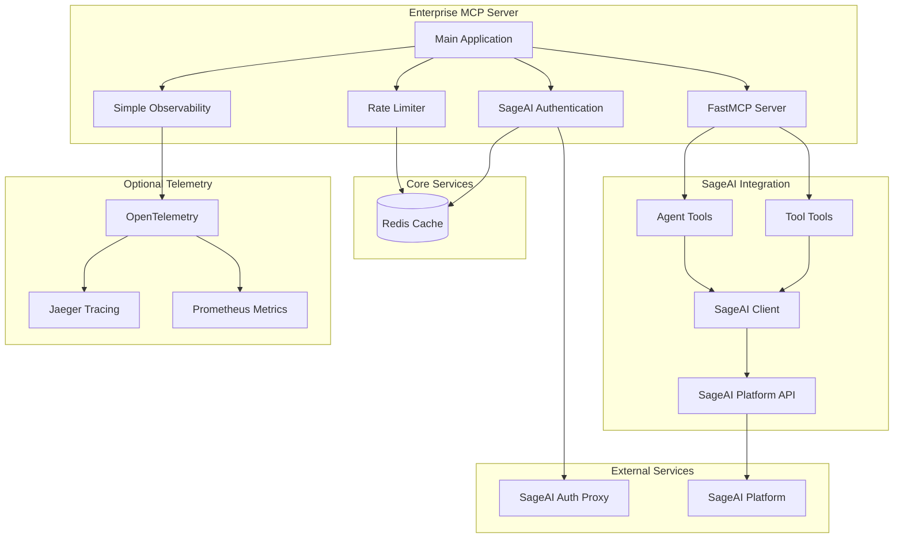
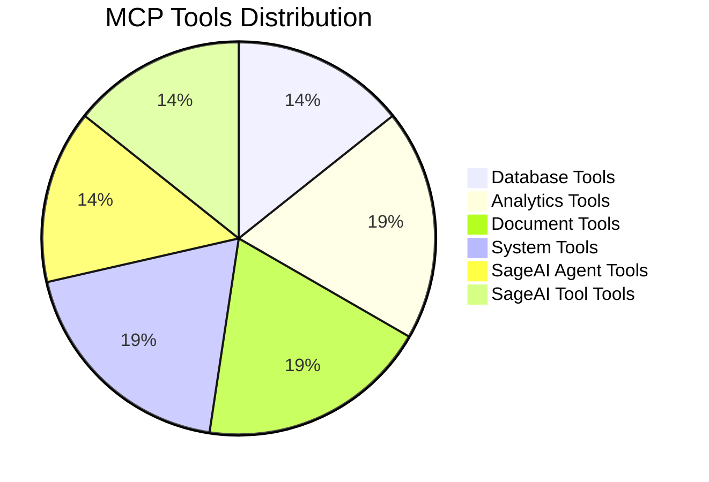
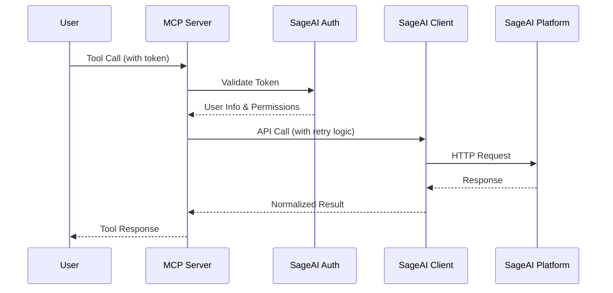
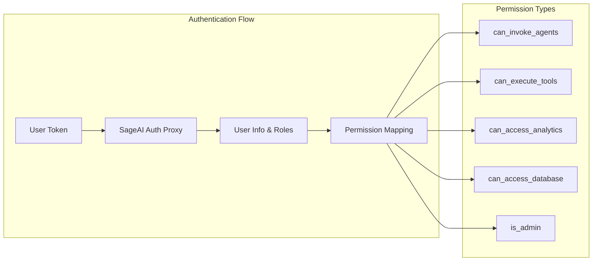
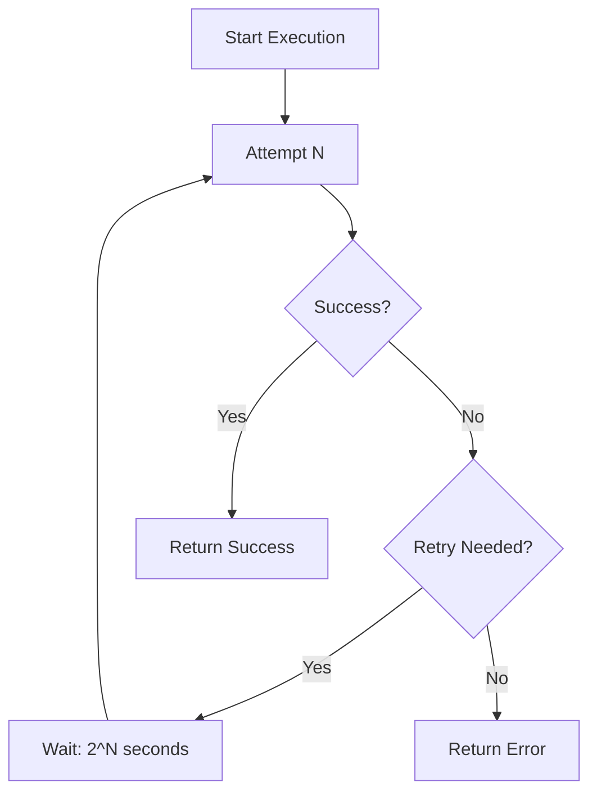
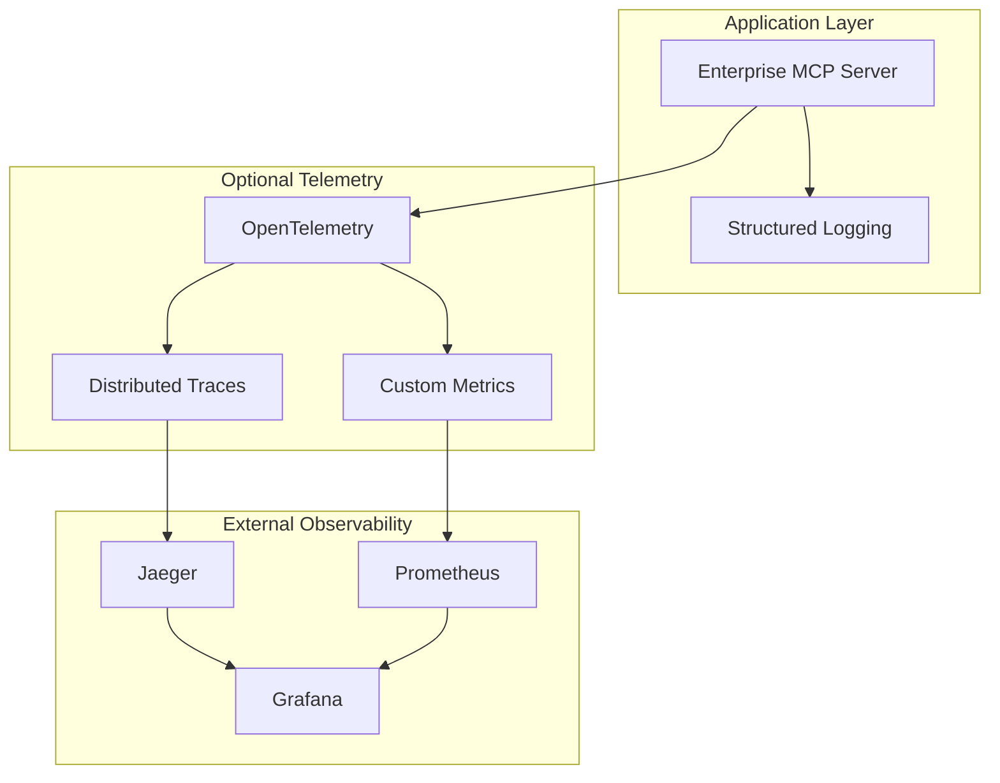

# Enterprise MCP Server Architecture

## **🏗️ System Architecture Diagram**

## **📊 Tool Categories**

## **🔄 SageAI Integration Flow**

## **🔐 Security & Permissions**

## **🔄 Retry Logic Flow**

## **📈 Observability Stack**

