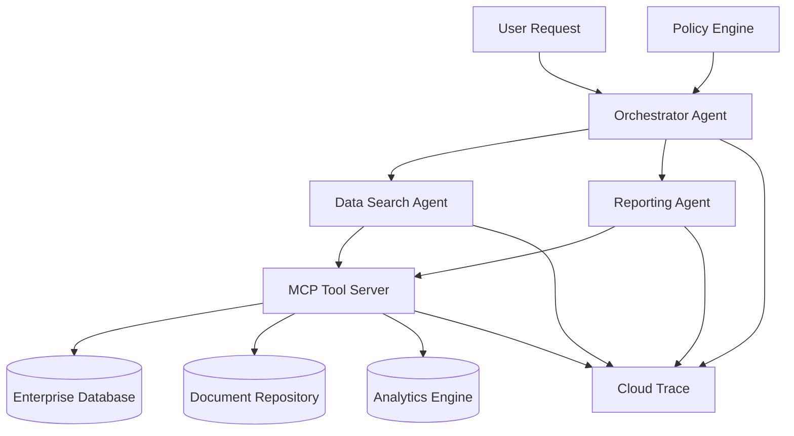

# Enterprise Multi-Agent System - Deployment Guide

## Architecture Overview



## Directory Structure
```
/src
├── /docs                            # System architecture, deployment docs
├── /mcp-server                      # The centralized MCP server
├── /orchestrator-agent              # The main orchestrator service
├── /data-search-agent               # A specialized agent for data retrieval
├── /reporting-agent                 # A specialized agent for generating reports
├── /example-agent                   # Example custom agent
└── /adk-shared                      # Shared library for common utils
```

## Deployment Files

### 1. Docker Compose for Local Development

```yaml
# docker-compose.yml
version: '3.8'

services:
  mcp-server:
    build: ./mcp-server
    ports:
      - "8000:8000"
    environment:
      - ENVIRONMENT=development
      - GOOGLE_CLOUD_PROJECT=${GOOGLE_CLOUD_PROJECT}
    volumes:
      - ./mcp-server/config:/app/config
    healthcheck:
      test: ["CMD", "curl", "-f", "http://localhost:8000/health"]
      interval: 30s
      timeout: 10s
      retries: 3

  orchestrator-agent:
    build: ./orchestrator-agent
    ports:
      - "8001:8000"
    environment:
      - ENVIRONMENT=development
      - MCP_SERVER_URL=http://mcp-server:8000
    depends_on:
      - mcp-server
    volumes:
      - ./orchestrator-agent/config:/app/config

  data-search-agent:
    build: ./data-search-agent
    ports:
      - "8002:8000"
    environment:
      - ENVIRONMENT=development
      - MCP_SERVER_URL=http://mcp-server:8000
    depends_on:
      - mcp-server
    volumes:
      - ./data-search-agent/config:/app/config

  reporting-agent:
    build: ./reporting-agent
    ports:
      - "8003:8000"
    environment:
      - ENVIRONMENT=development
      - MCP_SERVER_URL=http://mcp-server:8000
    depends_on:
      - mcp-server
    volumes:
      - ./reporting-agent/config:/app/config

  example-agent:
    build: ./example-agent
    ports:
      - "8004:8000"
    environment:
      - ENVIRONMENT=development
      - MCP_SERVER_URL=http://mcp-server:8000
    depends_on:
      - mcp-server
    volumes:
      - ./example-agent/config:/app/config
```

### 2. Google Cloud Run Deployment Script

```bash
#!/bin/bash
# deploy.sh - Deploy all services to Google Cloud Run

set -e

PROJECT_ID="your-gcp-project-id"
REGION="us-central1"

echo "Deploying Enterprise Multi-Agent System to Google Cloud Run..."

# Deploy MCP Server
echo "Deploying MCP Server..."
gcloud run deploy mcp-server \
  --source ./mcp-server \
  --region $REGION \
  --project $PROJECT_ID \
  --platform managed \
  --allow-unauthenticated \
  --memory 1Gi \
  --cpu 1 \
  --concurrency 100 \
  --max-instances 10 \
  --set-env-vars ENVIRONMENT=production \
  --set-env-vars GOOGLE_CLOUD_PROJECT=$PROJECT_ID

# Get MCP Server URL
MCP_URL=$(gcloud run services describe mcp-server --region=$REGION --format='value(status.url)')

# Deploy Data Search Agent
echo "Deploying Data Search Agent..."
gcloud run deploy data-search-agent \
  --source ./data-search-agent \
  --region $REGION \
  --project $PROJECT_ID \
  --platform managed \
  --allow-unauthenticated \
  --memory 1Gi \
  --cpu 1 \
  --concurrency 80 \
  --max-instances 5 \
  --set-env-vars ENVIRONMENT=production \
  --set-env-vars MCP_SERVER_URL=$MCP_URL

# Deploy Reporting Agent
echo "Deploying Reporting Agent..."
gcloud run deploy reporting-agent \
  --source ./reporting-agent \
  --region $REGION \
  --project $PROJECT_ID \
  --platform managed \
  --allow-unauthenticated \
  --memory 1Gi \
  --cpu 1 \
  --concurrency 50 \
  --max-instances 5 \
  --set-env-vars ENVIRONMENT=production \
  --set-env-vars MCP_SERVER_URL=$MCP_URL

# Get agent URLs
DATA_AGENT_URL=$(gcloud run services describe data-search-agent --region=$REGION --format='value(status.url)')
REPORTING_AGENT_URL=$(gcloud run services describe reporting-agent --region=$REGION --format='value(status.url)')

# Deploy Orchestrator Agent (needs agent URLs)
echo "Deploying Orchestrator Agent..."
gcloud run deploy orchestrator-agent \
  --source ./orchestrator-agent \
  --region $REGION \
  --project $PROJECT_ID \
  --platform managed \
  --allow-unauthenticated \
  --memory 2Gi \
  --cpu 1 \
  --concurrency 50 \
  --max-instances 10 \
  --set-env-vars ENVIRONMENT=production \
  --set-env-vars MCP_SERVER_URL=$MCP_URL \
  --set-env-vars DATA_AGENT_URL=$DATA_AGENT_URL \
  --set-env-vars REPORTING_AGENT_URL=$REPORTING_AGENT_URL

# Deploy Example Agent
echo "Deploying Example Agent..."
gcloud run deploy example-agent \
  --source ./example-agent \
  --region $REGION \
  --project $PROJECT_ID \
  --platform managed \
  --allow-unauthenticated \
  --memory 1Gi \
  --cpu 1 \
  --concurrency 50 \
  --max-instances 3 \
  --set-env-vars ENVIRONMENT=production \
  --set-env-vars MCP_SERVER_URL=$MCP_URL

echo "Deployment complete!"
echo "MCP Server: $MCP_URL"
echo "Data Search Agent: $DATA_AGENT_URL"
echo "Reporting Agent: $REPORTING_AGENT_URL"
ORCHESTRATOR_URL=$(gcloud run services describe orchestrator-agent --region=$REGION --format='value(status.url)')
echo "Orchestrator: $ORCHESTRATOR_URL"
```

### 3. Kubernetes Deployment

```yaml
# kubernetes/deployment.yaml
apiVersion: apps/v1
kind: Deployment
metadata:
  name: mcp-server
spec:
  replicas: 3
  selector:
    matchLabels:
      app: mcp-server
  template:
    metadata:
      labels:
        app: mcp-server
    spec:
      containers:
      - name: mcp-server
        image: gcr.io/PROJECT_ID/mcp-server:latest
        ports:
        - containerPort: 8000
        env:
        - name: ENVIRONMENT
          value: "production"
        resources:
          requests:
            memory: "512Mi"
            cpu: "250m"
          limits:
            memory: "1Gi"
            cpu: "500m"
        livenessProbe:
          httpGet:
            path: /health
            port: 8000
          initialDelaySeconds: 30
          periodSeconds: 10
        readinessProbe:
          httpGet:
            path: /health
            port: 8000
          initialDelaySeconds: 5
          periodSeconds: 5
---
apiVersion: v1
kind: Service
metadata:
  name: mcp-server-service
spec:
  selector:
    app: mcp-server
  ports:
  - port: 80
    targetPort: 8000
  type: ClusterIP
```

### 4. Terraform Infrastructure

```hcl
# infrastructure/main.tf
terraform {
  required_providers {
    google = {
      source  = "hashicorp/google"
      version = "~> 4.0"
    }
  }
}

provider "google" {
  project = var.project_id
  region  = var.region
}

# Enable required APIs
resource "google_project_service" "run_api" {
  service = "run.googleapis.com"
}

resource "google_project_service" "cloudbuild_api" {
  service = "cloudbuild.googleapis.com"
}

# Cloud Run services
resource "google_cloud_run_service" "mcp_server" {
  name     = "mcp-server"
  location = var.region

  template {
    spec {
      containers {
        image = "gcr.io/${var.project_id}/mcp-server:latest"
        
        env {
          name  = "ENVIRONMENT"
          value = "production"
        }
        
        resources {
          limits = {
            cpu    = "1000m"
            memory = "1Gi"
          }
        }
      }
    }
  }

  traffic {
    percent         = 100
    latest_revision = true
  }

  depends_on = [google_project_service.run_api]
}

# Variables
variable "project_id" {
  description = "GCP Project ID"
  type        = string
}

variable "region" {
  description = "GCP Region"
  type        = string
  default     = "us-central1"
}
```

## Environment Configuration

### Development Environment

```bash
# .env.development
ENVIRONMENT=development
GOOGLE_CLOUD_PROJECT=your-dev-project
MCP_SERVER_URL=http://localhost:8000
REDIS_URL=redis://localhost:6379
LOG_LEVEL=DEBUG
```

### Production Environment

```bash
# .env.production
ENVIRONMENT=production
GOOGLE_CLOUD_PROJECT=your-prod-project
MCP_SERVER_URL=https://mcp-server-url
REDIS_URL=redis://redis-instance:6379
LOG_LEVEL=INFO
```

## Health Checks

### Service Health Endpoints

- **MCP Server**: `GET /health`
- **Orchestrator**: `GET /health`
- **Data Search Agent**: `GET /health`
- **Reporting Agent**: `GET /health`
- **Example Agent**: `GET /health`

### Health Check Script

```bash
#!/bin/bash
# health-check.sh

SERVICES=(
  "mcp-server:8000"
  "orchestrator-agent:8001"
  "data-search-agent:8002"
  "reporting-agent:8003"
  "example-agent:8004"
)

for service in "${SERVICES[@]}"; do
  IFS=':' read -r name port <<< "$service"
  echo "Checking $name..."
  
  if curl -f "http://localhost:$port/health" > /dev/null 2>&1; then
    echo "✅ $name is healthy"
  else
    echo "❌ $name is unhealthy"
  fi
done
```

## Monitoring and Observability

### Cloud Monitoring Setup

```yaml
# monitoring/cloud-monitoring.yaml
apiVersion: v1
kind: ConfigMap
metadata:
  name: cloud-monitoring-config
data:
  monitoring.yaml: |
    exporters:
      googlecloud:
        project: ${GOOGLE_CLOUD_PROJECT}
        metric:
          prefix: "enterprise_agents"
    
    service:
      pipelines:
        metrics:
          exporters: [googlecloud]
        traces:
          exporters: [googlecloud]
```

### Grafana Dashboard

```json
{
  "dashboard": {
    "title": "Enterprise Multi-Agent System",
    "panels": [
      {
        "title": "Request Rate",
        "type": "graph",
        "targets": [
          {
            "expr": "rate(requests_total[5m])",
            "legendFormat": "{{service}}"
          }
        ]
      },
      {
        "title": "Response Time",
        "type": "graph",
        "targets": [
          {
            "expr": "histogram_quantile(0.95, rate(response_time_bucket[5m]))",
            "legendFormat": "95th percentile"
          }
        ]
      }
    ]
  }
}
```

## Security Configuration

### Service Account Setup

```bash
# Create service account
gcloud iam service-accounts create enterprise-agents \
  --display-name="Enterprise Multi-Agent System"

# Grant necessary permissions
gcloud projects add-iam-policy-binding PROJECT_ID \
  --member="serviceAccount:enterprise-agents@PROJECT_ID.iam.gserviceaccount.com" \
  --role="roles/cloudtrace.agent"

gcloud projects add-iam-policy-binding PROJECT_ID \
  --member="serviceAccount:enterprise-agents@PROJECT_ID.iam.gserviceaccount.com" \
  --role="roles/monitoring.metricWriter"
```

### Network Security

```yaml
# security/network-policy.yaml
apiVersion: networking.k8s.io/v1
kind: NetworkPolicy
metadata:
  name: enterprise-agents-policy
spec:
  podSelector:
    matchLabels:
      app: enterprise-agents
  policyTypes:
  - Ingress
  - Egress
  ingress:
  - from:
    - podSelector:
        matchLabels:
          app: enterprise-agents
  egress:
  - to:
    - podSelector:
        matchLabels:
          app: enterprise-agents
```

## Troubleshooting

### Common Issues

1. **Service Discovery Issues**
   ```bash
   # Check agent registry
   curl http://localhost:8001/agents
   ```

2. **Health Check Failures**
   ```bash
   # Check service logs
   docker-compose logs mcp-server
   ```

3. **Performance Issues**
   ```bash
   # Check resource usage
   docker stats
   ```

### Debug Commands

```bash
# Check service connectivity
curl -X POST http://localhost:8001/process \
  -H "Content-Type: application/json" \
  -d '{"query": "Test request"}'

# Check agent capabilities
curl http://localhost:8001/agents

# Check system metrics
curl http://localhost:8001/metrics
```

## Scaling Configuration

### Horizontal Pod Autoscaler

```yaml
# scaling/hpa.yaml
apiVersion: autoscaling/v2
kind: HorizontalPodAutoscaler
metadata:
  name: mcp-server-hpa
spec:
  scaleTargetRef:
    apiVersion: apps/v1
    kind: Deployment
    name: mcp-server
  minReplicas: 2
  maxReplicas: 10
  metrics:
  - type: Resource
    resource:
      name: cpu
      target:
        type: Utilization
        averageUtilization: 70
  - type: Resource
    resource:
      name: memory
      target:
        type: Utilization
        averageUtilization: 80
```

### Cloud Run Scaling

```bash
# Configure Cloud Run scaling
gcloud run services update mcp-server \
  --min-instances=2 \
  --max-instances=10 \
  --concurrency=100 \
  --cpu=1 \
  --memory=1Gi
```

This deployment guide provides comprehensive instructions for deploying the enterprise multi-agent system across different environments and platforms.
