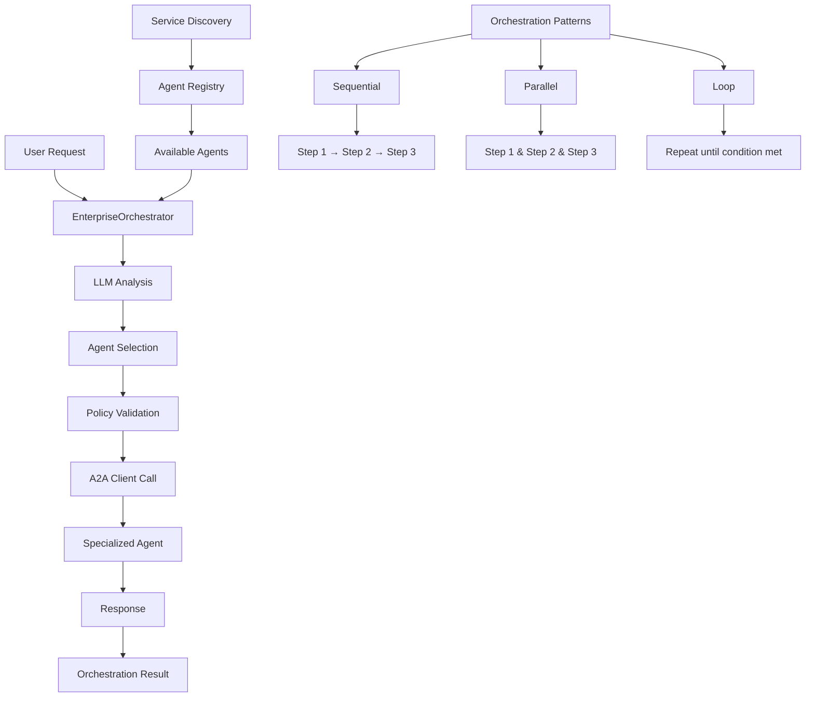
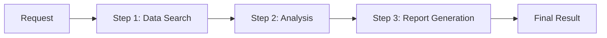
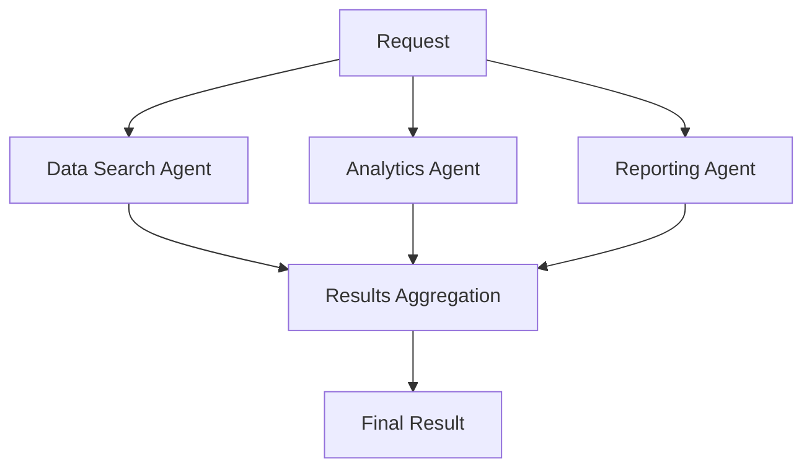
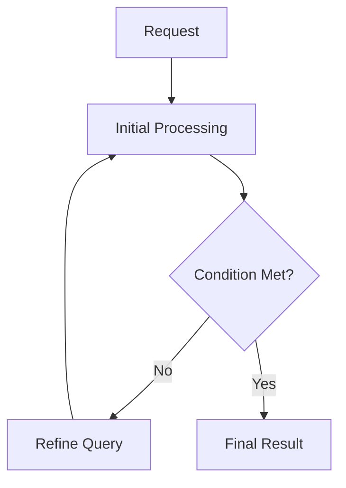
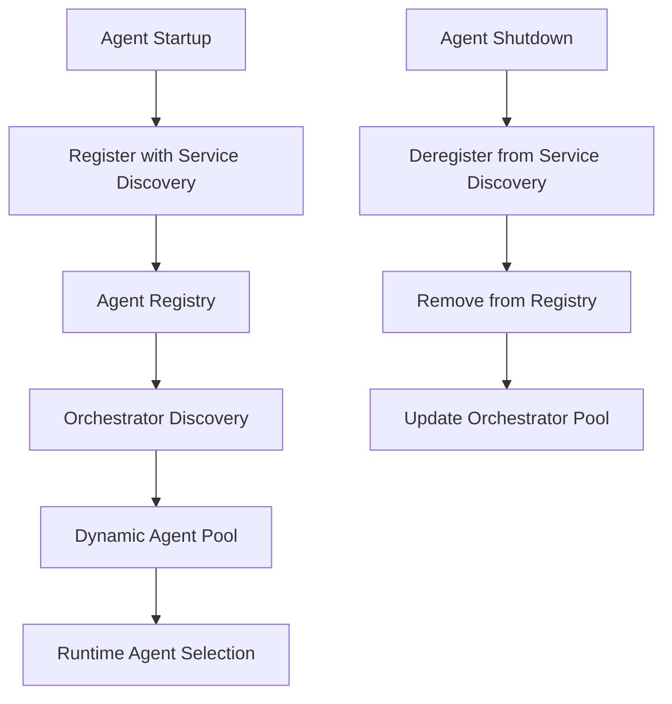

# Orchestrator Architecture

## How the Orchestrator Works



## Orchestration Patterns

### 1. Sequential Orchestration


### 2. Parallel Orchestration


### 3. Loop Orchestration


## Service Discovery Architecture



## Current vs. Proposed Architecture

### Current (Hardcoded)
```yaml
agents:
  - name: "DataSearchAgent"
    url: "https://data-search-agent-service-url"
    capabilities: ["database queries", "document search", "data retrieval"]
```

### Proposed (Service Discovery)
```python
# Agents auto-register on startup
await agent.register_with_discovery(
    name="DataSearchAgent",
    capabilities=["database queries", "document search", "data retrieval"],
    health_check_url="http://localhost:8002/health"
)

# Orchestrator discovers agents dynamically
available_agents = await orchestrator.discover_agents()
```

## Implementation Components

### 1. Service Discovery Service
- **Redis-based registry** for agent discovery
- **Health check monitoring** for agent availability
- **Capability-based filtering** for agent selection
- **Load balancing** for multiple instances

### 2. Agent Registration
- **Auto-registration** on agent startup
- **Capability declaration** with metadata
- **Health check endpoints** for monitoring
- **Graceful deregistration** on shutdown

### 3. Orchestrator Discovery
- **Dynamic agent discovery** from registry
- **Real-time capability updates** from agents
- **Fallback mechanisms** for unavailable agents
- **Load balancing** across agent instances

### 4. Orchestration Patterns
- **SequentialAgent**: Step-by-step execution
- **ParallelAgent**: Concurrent execution
- **LoopAgent**: Iterative execution with conditions
- **Custom patterns**: User-defined orchestration flows

## Benefits of Service Discovery

1. **Dynamic Scaling**: Add/remove agents without configuration changes
2. **Fault Tolerance**: Automatic failover to available agents
3. **Load Balancing**: Distribute requests across multiple agent instances
4. **Real-time Updates**: Agents can update capabilities dynamically
5. **Zero Downtime**: Deploy new agents without orchestrator restart
6. **Monitoring**: Track agent health and performance metrics

## Configuration vs. Discovery

| Aspect | Configuration-based | Service Discovery |
|--------|-------------------|------------------|
| **Agent Addition** | Manual config update | Automatic registration |
| **Scaling** | Manual configuration | Dynamic scaling |
| **Fault Tolerance** | Static failover | Dynamic failover |
| **Monitoring** | Limited visibility | Full observability |
| **Deployment** | Requires restart | Zero downtime |
| **Maintenance** | High manual effort | Automated management |
