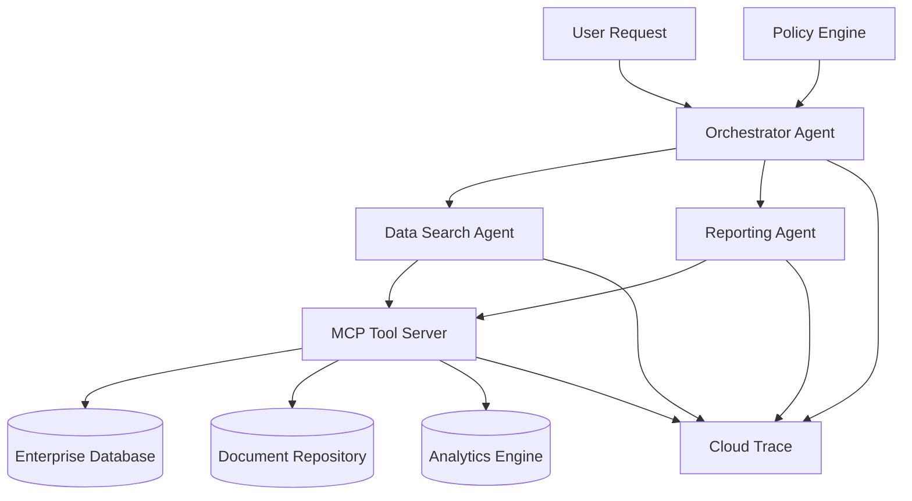

# Enterprise Multi-Agent System

## Architecture Overview



## Directory Structure
```
/src
├── /mcp-server                      # The centralized MCP server
├── /orchestrator-agent              # The main orchestrator service
├── /data-search-agent               # A specialized agent for data retrieval
├── /reporting-agent                 # A specialized agent for generating reports
├── /adk-shared                      # Shared library for common utils
├── /infrastructure                  # Deployment and infrastructure files
└── /docs                            # System architecture, deployment docs
```

## Quick Start

### 1. Local Development

```bash
# Start all services with Docker Compose
cd src/infrastructure
docker-compose up -d

# Check service health
curl http://localhost:8000/health  # MCP Server
curl http://localhost:8001/health  # Orchestrator
curl http://localhost:8002/health  # Data Search Agent
curl http://localhost:8003/health   # Reporting Agent
```

### 2. Production Deployment

```bash
# Deploy to Google Cloud Run
cd src/infrastructure
./deploy.sh
```

## Service Endpoints

### MCP Server (Port 8000)
- `GET /health` - Health check
- `GET /tools` - List available tools
- `POST /execute` - Execute a tool

### Orchestrator Agent (Port 8001)
- `GET /health` - Health check
- `POST /process` - Process user requests
- `GET /agents` - List available agents

### Data Search Agent (Port 8002)
- `GET /health` - Health check
- `POST /process_request` - Process data search requests

### Reporting Agent (Port 8003)
- `GET /health` - Health check
- `POST /process_request` - Process reporting requests

## Configuration

Each service has its own configuration directory:
- `mcp-server/config/` - Tool configurations
- `orchestrator-agent/config/` - Agent routing and policy configurations
- `data-search-agent/config/` - Data agent specific configurations
- `reporting-agent/config/` - Reporting agent configurations

## Observability

The system includes comprehensive observability:
- **Tracing**: OpenTelemetry distributed tracing
- **Metrics**: Custom metrics for agent performance
- **Logging**: Structured logging with correlation IDs
- **Health Checks**: Service health monitoring

## Security

- JWT-based authentication between services
- Policy-driven access control
- Audit trails for all operations
- Data encryption at rest and in transit

## Development

### Adding New Agents

1. Create a new agent directory under `src/`
2. Implement the agent following the existing patterns
3. Add configuration files
4. Update the orchestrator configuration
5. Deploy using the infrastructure scripts

### Adding New Tools

1. Create tool classes in `mcp-server/src/`
2. Register tools in the MCP server
3. Update tool configurations
4. Deploy the MCP server

## Monitoring

- **Health Endpoints**: Each service provides health check endpoints
- **Metrics**: Prometheus-compatible metrics
- **Tracing**: Jaeger-compatible distributed tracing
- **Logs**: Structured JSON logs with correlation IDs

## Troubleshooting

### Common Issues

1. **Service Discovery**: Ensure all services can communicate
2. **Authentication**: Check JWT token configuration
3. **Policy Violations**: Review policy configurations
4. **Performance**: Monitor resource utilization and scaling

### Debug Commands

```bash
# Check service logs
docker-compose logs mcp-server
docker-compose logs orchestrator-agent

# Test service connectivity
curl -X POST http://localhost:8001/process \
  -H "Content-Type: application/json" \
  -d '{"query": "Find sales data for Q1 2024"}'
```

## Support

For issues and questions:
- Check the logs for error messages
- Review the configuration files
- Test individual service endpoints
- Consult the troubleshooting guide
